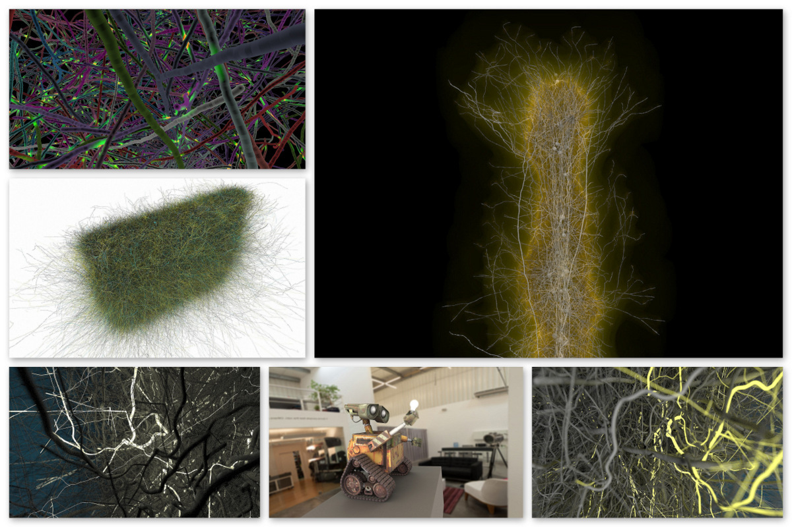

# Brayns



One of the keys towards understanding how the brain works as a whole is
visualisation of how the individual cells function. In particular, the more
morphologically accurate the visualisation can be, the easier it is for experts
in the biological field to validate cell structures; photo-realistic rendering
is therefore important.

The Blue Brain Project has made major efforts to create morphologically accurate
neurons to simulate sub-cellular and electrical activities, e.g. molecular
simulations of neuron biochemistry or multi-scale simulations of neuronal
function. Ray-tracing can help to highlight areas of the circuits where cells
touch each other and where synapses are being created. In combination with
‘global illumination’, which uses light, shadow, and depth of field effects to
simulate photo-realistic images, this technique makes it easier to visualise how
the neurons function.

Brayns is a minimalistic visualiser that can perform ray-traced rendering of
neurons. It provides an abstraction of the underlying rendering engines, so that
the best possible acceleration libraries can be used for the relevant hardware.
(https://github.com/BlueBrain/Brayns.git).

To keep track of the changes between releases check the [changelog](Changelog.md).

Contact: bbp-open-source@googlegroups.com

## Architecture


## User guide

Command line arguments are documented in the [User Guide](doc/UserGuide.md).

## About

The following platforms and build environments are tested:

* Linux: Ubuntu 16.04, Debian 9, RHEL 6.8 (Makefile, x64)

The [API documentation](http://bluebrain.github.io/Brayns-0.1/index.html)
can be found on [bluebrain.github.io](http://bluebrain.github.io/).

## Building from Source

### Prerequisites

In order to ease the application compilation process, we recommend using the
following tree structure:

```
- src
  +- ispc-v1.9.1-linux
  +- OSPRay
  +- OptiX
  +- BRayns
```

#### Intel ISPC compiler

Download and extract [ISPC compiler 1.9.1 archive](https://ispc.github.io/downloads.html).

#### Embree

Clone embree in the same folder level as ISPC compiler

```
  git clone https://github.com/embree/embree.git
  mkdir embree/Build
  cd embree/Build
  git checkout <latest_release>
  cmake .. -DCMAKE_INSTALL_PREFIX=<Brayns_installation_folder>
  make install
```

#### OSPRay

Clone OSPRay in the same folder level as ISPC compiler

```
  git clone https://github.com/ospray/OSPRay.git
  mkdir OSPRay/Build
  cd OSPRay/Build
  git checkout <latest_release>
  export CMAKE_PREFIX_PATH=<Brayns_installation_folder>
  cmake .. -DCMAKE_INSTALL_PREFIX=<Brayns_installation_folder>
  make install
```

### Brayns

```
  git clone --recursive https://github.com/BlueBrain/Brayns.git
  mkdir Brayns/Build
  cd Brayns/Build
  cmake .. -DCLONE_SUBPROJECTS=ON -DCMAKE_INSTALL_PREFIX=<Brayns_installation_folder>
  make install
```

A number of dependencies are optional, and are related to some specific Brayns
features:

#### Enable/Disable [assimp](https://github.com/assimp/assimp) supported mesh file loader (.obj, .ply, etc.)
```
cmake .. -DBRAYNS_ASSIMP_ENABLED=ON:OFF
```

#### Enable/Disable [Brion](https://github.com/BlueBrain/Brion) supported morphology file loader (.h5, .swc, BlueConfig, CircuitConfig)
```
cmake .. -DBRAYNS_BRION_ENABLED=ON:OFF
```

#### Enable/Disable [Deflect](https://github.com/BlueBrain/Deflect) for streaming to [Tide](https://github.com/BlueBrain/Tide), the Tiled Interactive DisplayWall environment.
```
cmake .. -DBRAYNS_DEFLECT_ENABLED=ON:OFF
```

#### Enable/Disable [ImageMagick](http://www.imagemagick.org) image loading
```
cmake .. -DBRAYNS_IMAGEMAGICK_ENABLED=ON:OFF
```

#### Enable/Disable HTTP/REST/Websockets interface.
 [LibJpegTurbo](http://libjpeg-turbo.virtualgl.org) and
 [Rockets](https://github.com/BlueBrain/Rockets).
 See documentation for REST API details.
```
cmake .. -DBRAYNS_NETWORKING_ENABLED=ON:OFF
```

## Running Brayns viewer

```
export PATH=<Brayns_installation_folder>/bin:$PATH
export LD_LIBRARY_PATH=<Brayns_installation_folder>/lib:$LD_LIBRARY_PATH
braynsViewer
```

## Running Brayns off-screen service

```
export PATH=<Brayns_installation_folder>/bin:$PATH
export LD_LIBRARY_PATH=<Brayns_installation_folder>/lib:$LD_LIBRARY_PATH
braynsService
```

## Known Bugs

Please file a [Bug Report](https://github.com/BlueBrain/Brayns/issues) if you
find new issues which have not already been reported in
[Bug Report](https://github.com/BlueBrain/Brayns/issues) page. If you find an
already reported problem, please update the corresponding issue with your inputs
and outputs.
