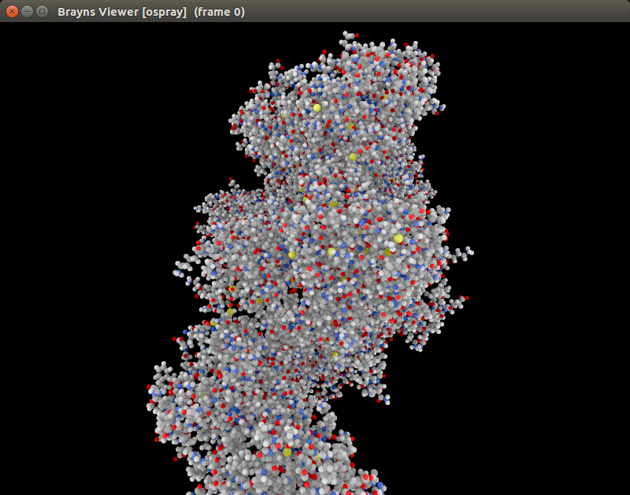
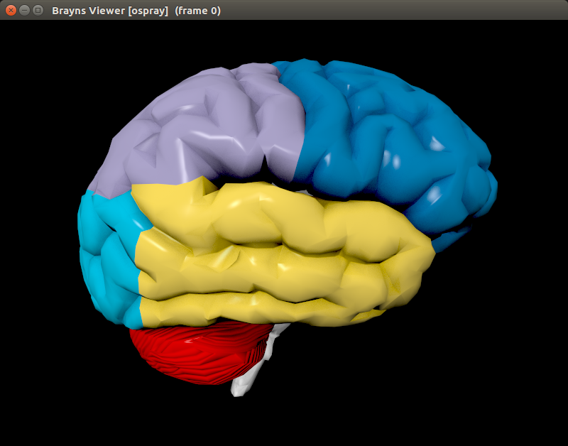
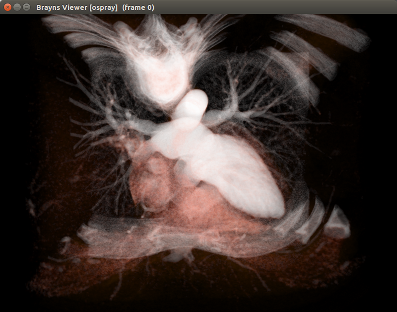

# Brayns user guide

## Basic usage

Brayns takes any number of files or folders as argument. To open a single file:
```
braynsViewer model.obj
```

## Molecules

PDB files can be easily loaded:

```
braynsViewer 4IMY.pdb
```




## Meshes

Brayns can load file formats supported by the [assimp](https://github.com/assimp/assimp) library.

```
braynsViewer mesh.obj|ply
```




## Point cloud

A XYZ file is a binary encoded list of x,y and z double positions.

```
braynsViewer sample.xyz
```

## Volumes

Brayns currently only supports 8-bit raw volume. The ```--volume-dimensions```
command line argument specifies the size of the volume and is required if the raw
volume file is specified. It is recommended though to use the MHD format.
Otherwise, ```--volume-element-spacing``` that defines the size of the voxels
and ```--volume-offset``` that defines the volume position in world coordinates,
are required.

```
braynsViewer volume.raw --volume-dimensions 512 512 256
braynsViewer volume.mhd
```




# Rendering parameters

## Renderers

The ```--renderer``` command line argument specifies which renderer is used by Brayns.
Four renderers are currently supported:

| Argument            | Description
| --------------------| -------------
| basic               | Provides basic features like phong/blinn shading and light emission
| basic_simulation    | Enhances ```basic``` with transparency and simulation rendering
| advanced_simulation | Enhances ```basic_simulation``` with reflection, refraction, volume rendering, shadows and ambient occlusion
| proximity           | Displays information about element proximity in 3D space. Typically used to find touches between neurons.
| pathtracer          | Path tracing renderer
| scivis              | Scientific visualization example renderer provided by OSPRay


## Camera types

The ```--camera``` command line argument defines the type of camera to be used
by the renderer. Five cameras are currently supported:

| Argument             | Description
| ---------------------| -------------
| perspective          | Perspective camera
| orthographic         | Orthographic camera
| panoramic            | 360 degrees camera

```
braynsViewer --camera orthographic
```

## Head light

The ```--no-head-light``` command line argument deactivates the light in
direction of the camera.

```
braynsViewer --no-head-light
```
