# Brayns user guide

## Data sources

### Morphologies

#### Loading data

The generic (optional) command line argument ```--input-paths``` can be used to specify files and/or folders to load data from.

#### Loading morphologies

SWC or H5 morphology files (supported by the [Brion](https://github.com/BlueBrain/Brion) library) can be loaded
easily.

```
braynsViewer ~/morphologies
```

### Loading a circuit

BlueConfig or CircuitConfig files (supported by the Brion library) can be
loaded. The ```--circuit-targets``` command line argument specified the circuit target
(or multiples separated by comma), and the ```--circuit-report``` command line
argument specifies the simulation report to be rendered.

Example of how to load a circuit with voltages simulation for layer 1 cells:

```
braynsViewer ~/circuits/BlueConfig --circuit-targets Layer1 --circuit-report voltages
```

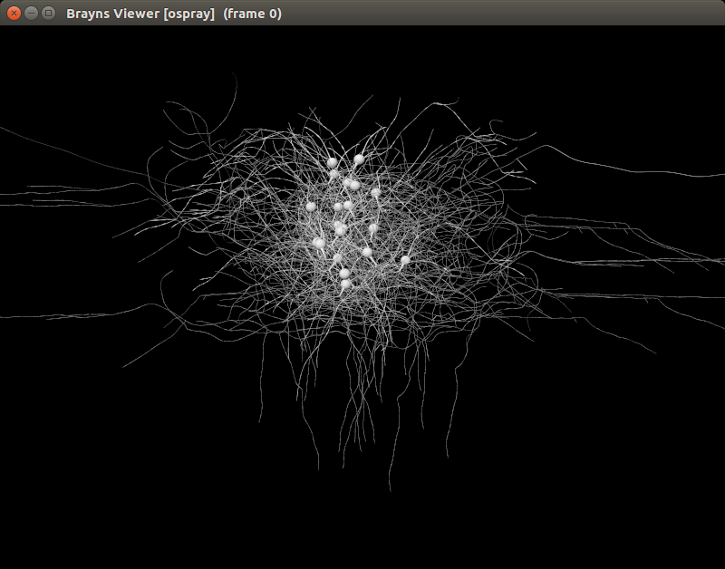

#### Bounding box

Defining a bounding box will prevent any geometry located outside of the box
from being loaded. The ```--circuit-bounding-box``` command line argument takes six
float values. The first three values being the lower bound of the box, and the
next three values defining the upper bound.

Example of how to define a circuit bounding box:
```
braynsViewer ~/circuits/BlueConfig --circuit-bounding-box -100 -100 -100 100 100 100
```

#### Density

The ```--circuit-density``` command line argument defines how many of the circuit
cells should be loaded. For example, if a density of 5 is specified, one cell
in 20 will be loaded. Brayns reads the cells in GID order.

Example of how to load 10% of the circuit:
```
braynsViewer ~/circuits/BlueConfig --circuit-density 10
```

### Loading a NEST circuit

The ```--nest-config``` command line argument define the NEST circuit to be loaded by
Brayns. The ```--nest-report``` command line argument specifies the report to be
rendered. The ```--nest-cache-file``` command line argument needs to be specified in
order to generate the cache file that Brayns uses to render the simulation. If
the simulation cache file already exists, Brayns connects to it. If it does not,
 Brayns creates it.

### Options

#### Layout
When loading several morphologies, Brayns allows the user to position them with
a specific layout. Typically, the user might want to visualize cells next to
each other. The ```--morphology-layout``` command line argument specifies the number
of cells per line, as well as the horizontal and vertical spacing between each
of those cells. Units used for the horizontal and vertical spacing are the ones
from the H5 and SWC files.

```
braynsViewer ~/morphologies --morphology-layout 5 100 100
```

#### Section types

Brayns allows the user to specify which section type of the morpholoy should be
loaded. Sections type are soma, axon, dendrite and apical dendrite. Those types
can be combined together by adding their corresponding values (1 for the soma,
2 for the Axon, 4 for dendrites and 8 for apical dendrites). For example, if one
wants to visualize the somas and the axons, the ```--morphology-section-types```
command line argument should then be set to 3.

```
braynsViewer ~/morphologies --morphology-section-types 3
```

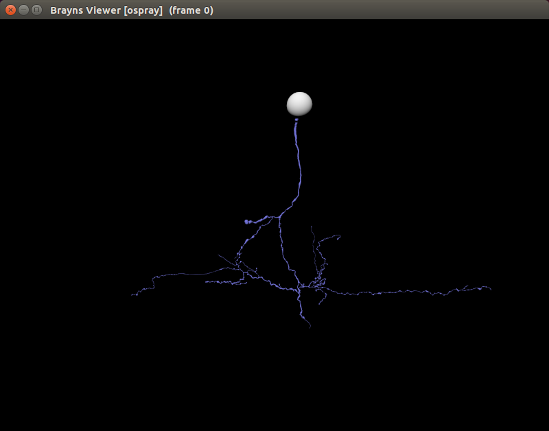

```
braynsViewer ~/morphologies --morphology-section-types 5
```

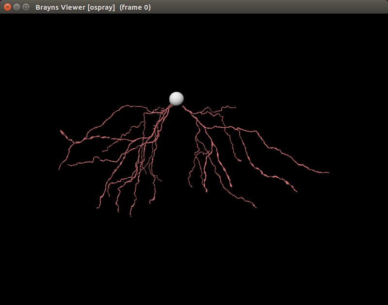

```
braynsViewer ~/morphologies --morphology-section-types 9
```


#### Geometry quality

Brayns supports three quality levels for morphologies. The low quality draws
one line per section, the medium quality divides the number of segment by 4, and
the high quality renders the full morphology.

```
braynsViewer ~/morphologies --geometry-quality low
```

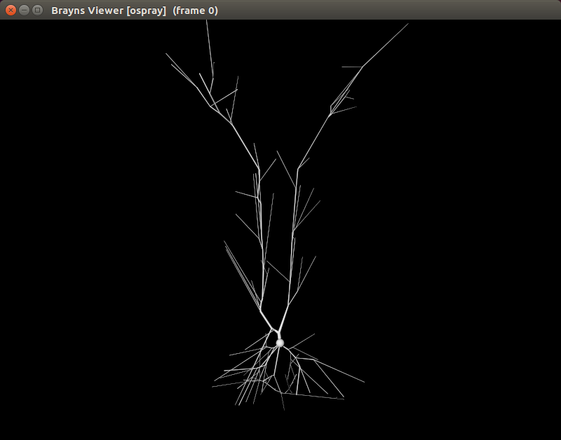


```
braynsViewer ~/morphologies --geometry-quality medium
```


```
braynsViewer ~/morphologies --geometry-quality high
```


#### Radius multiplier

The ```--radius-multiplier``` command line parameters specifies the multiplier applied
to morphology radii. Typically, a value of 3 multiplies all radii by 3.

```
braynsViewer ~/morphologies --radius-multiplier 3
```


#### Radius correction

The ```--radius-correction``` command line parameters specifies a unique radius
applied to all segments of the morphology. The unit is the one of the loaded
H5/SWC files.

```
braynsViewer ~/morphologies --radius-correction 1
```


#### Color scheme

The ```--color-scheme``` command line argument specifies how materials are applied to
the morphology. Available values are:

| Argument             | Description
| ---------------------| -------------
| neuron-by-id         | Each neuron has a different color
| neuron-by-segment-id | Somas are white, axons are blue, dendrites are red, and apical dendrites are purple
| neuron-by-layer      | A different color is assigned for every layer. All neurons belonging to a specific layer as the same color
| neuron-by-mtype      | Each morphological type has a different color
| neuron-by-etype      | Each electro-physiologic type has a different color
| protein-by-id        | Each protein has a different color
| protein-atoms        | Atoms have standard colors
| protein-chains       | Each chain has a different color

```
braynsViewer ~/morphologies --color-scheme neuron-by-id
```

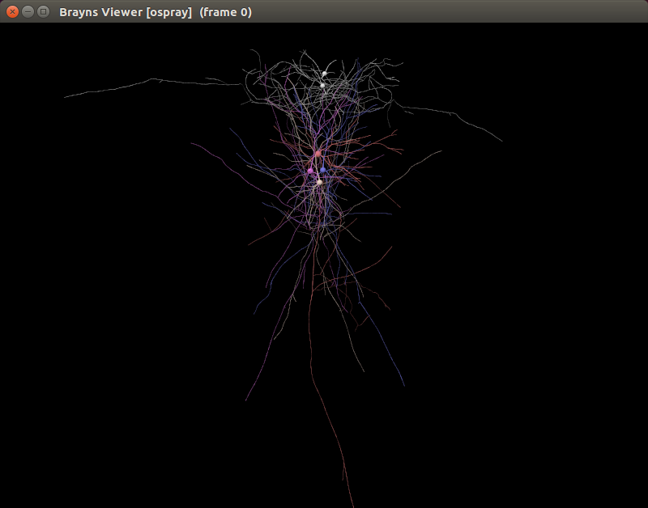

```
braynsViewer ~/morphologies --color-scheme neuron-by-segment-type
```

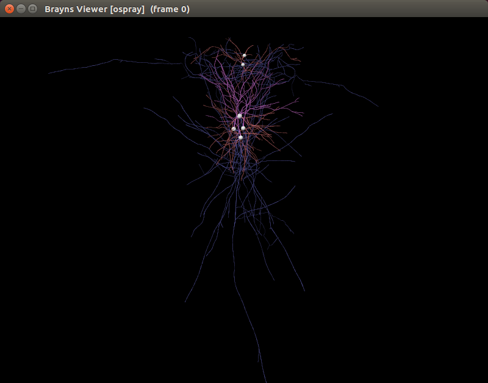

#### Realistic somas

Command lines argument starting with metaballs tell Brayns to reconstruct somas using the metaballs algorithm. The ```--metaballs-grid-size``` command line
argument defines the precision of the generated mesh. The ```--metaballs-threshold```
command line argument specifies the threshold for the isosurface defined by
function [f(x,y,z) = x^2 + y^2 + z^2]. The ```--metaballs-samples-from-soma```
command line argument defines how many samples from around the soma should be
considered when generating the mesh.

```
braynsViewer ~/morphologies --metaballs-grid-size 60 --metaballs-threshold 1 --metaballs-samples-from-soma 5
```


## Molecules

### Loading a single molecule

PDB files can be easily loaded:

```
braynsViewer 4IMY.pdb
```


### Loading molecules from folder

Loads all PDB file located in the specified folder:

```
braynsViewer ~/hiv --color-scheme protein-chains
```

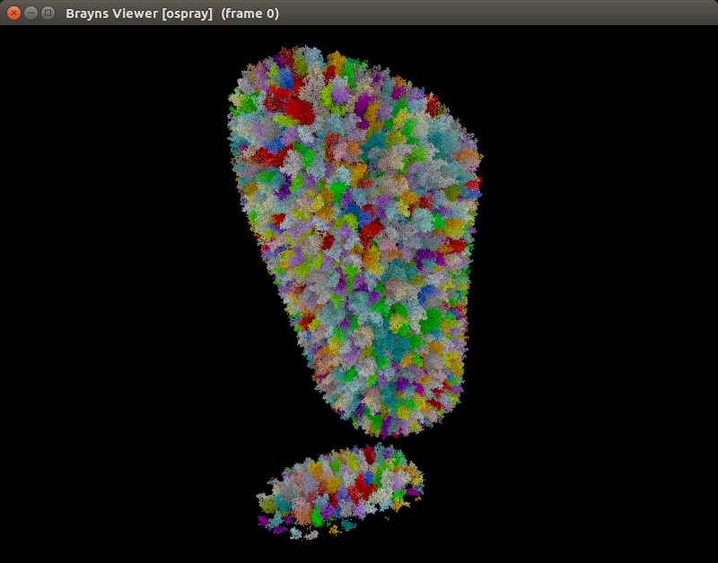

## Meshes

### Loading meshes

Brayns can load file formats supported by the [assimp](https://github.com/assimp/assimp) library.

```
braynsViewer ~/meshes
```


## Point cloud

A XYZ file is a binary encoded list of x,y and z double positions.

```
braynsViewer sample.xyz
```

## Cache file

In order to accelerate the loading of large scenes, models can be dumped into
binary files that can then be reloaded by Brayns. The ```--save-cache-file``` command
line argument specifies the filename of the file into which the 3D scene should
be saved. The ```--load-cache-file``` command line argument specifies the file to be
loaded by Brayns. Note that cache files are only supported by the OSPRay engine.
Any other command line parameter defining a data source will be ignored by
Brayns.

```
braynsViewer --save-cache-file cache
braynsViewer --load-cache-file cache
```

## Volumes

The ```--volume-file``` command line argument specifies the volume file to load.
Brayns currently only supports 8-bit raw volume. The ```--volume-dimensions```
command line argument specifies the size of the volume and is always required.
The ```--volume-element-spacing``` defines the size of the voxels. The ```--volume-offset```
command line argument defines the volume position in world coordinates.

```
braynsViewer --volume-file volume.raw --volume-dimensions 512 512 256
```


```
braynsViewer --volume-file volume.raw --volume-dimensions 512 512 256 --shadows 1 --soft-shadows 1
```

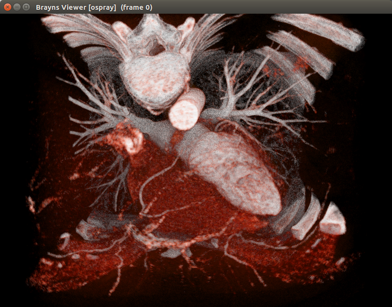

# Rendering parameters

## Engines

The ```--engine``` command line argument specifies the underlying rendering engine
used by Brayns. Two engines are currently supported:
- [OSPRay](http://www.ospray.org/): A Ray Tracing Based Rendering Engine for High-Fidelity Visualization

- [OptiX](https://developer.nvidia.com/optix): A software development kit for achieving high performance ray tracing
on the GPU

```
braynsViewer --engine <ospray|optix>
```

## Renderers

The ```--renderer``` command line argument specifies which renderer is used by Brayns.
Four renderers are currently supported:

| Argument  | Description
| ----------| -------------
| default   | Common renderer to all engines. Provides basic features such as phong/blinn shading, shadows, ambient occlusion, light emission, reflection and refraction.
| simulation| Same as default with extra features such as support for simulations and volumes.
| particle |
| proximity | Displays information about element proximity in 3D space. Typically used to find touches between neurons.

## Camera types

The ```--camera``` command line argument defines the type of camera to be used
by the renderer. Five cameras are currently supported:

| Argument             | Description
| ---------------------| -------------
| perspective          | Perspective camera
| stereo               | Side-by-side camera
| orthographic         | Orthographic camera
| panoramic            | 360 degrees camera
| clipped              | Perspective camera allowing clipping planes

```
braynsViewer --camera orthographic
```

## Head light

The ```--head-light``` command line argument aligns the light direction to the one
of the camera. A value of 1 activate the feature, 0 deactivates it.

```
braynsViewer --head-light 1
```

## Shadows

The ```--shadows``` command line argument determines the intensity of the shadows.
A value of 1 activates full shadows, 0 deactivates it. By default, shadows are
hard. The ```--soft-Shadows``` command line argument defines the softness of the
shadows.

```
braynsViewer --shadows 0.3
```

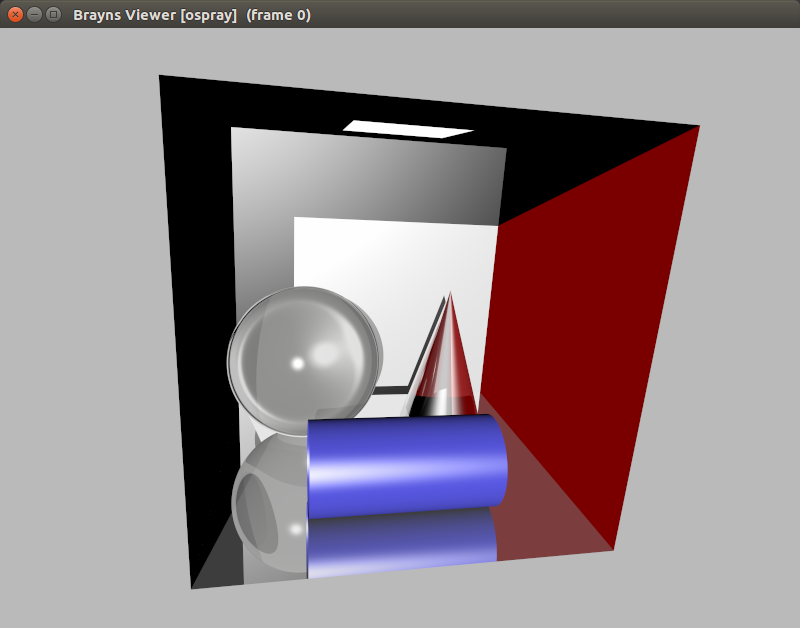

```
braynsViewer --shadows 0.6 --soft-shadows 0.1
```

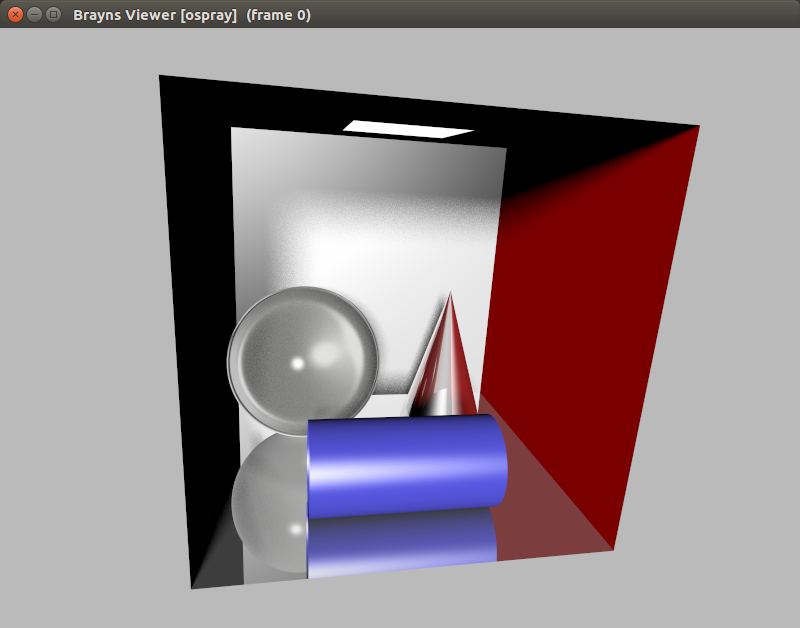

## Ambient occlusion

The ```--ambient-occlusion``` command line argument determines the strength of the
ambient occlusion. The value is a float between 0 and 1 (0 for no occlusion,
and 1 for maximum occlusion).

```
braynsViewer --ambient-occlusion 1
```

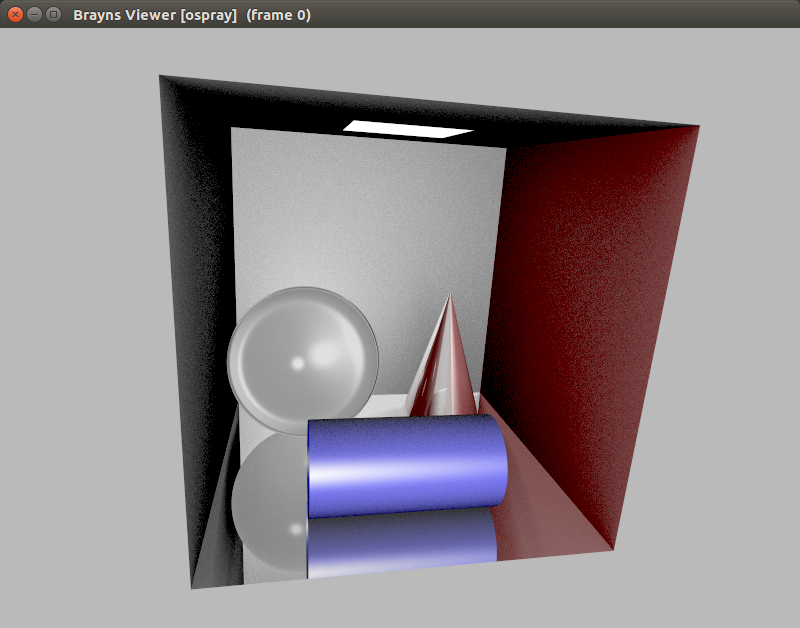
