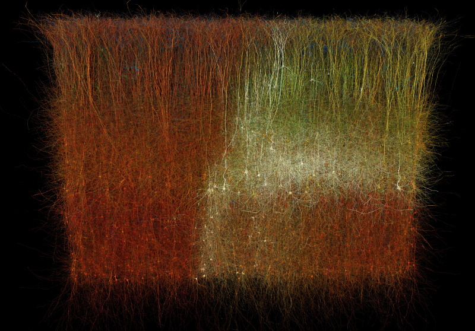

# Circuit explorer plugin for Brayns

## Description
This module implements the visualization of BBP circuits

## Usage
- Point LD_LIBRARY_PATH to the folder which contains
  'libcircuitExplorer.so'
- Run Brayns application either with command line '--plugin circuitExplorer'

## Screenshots

