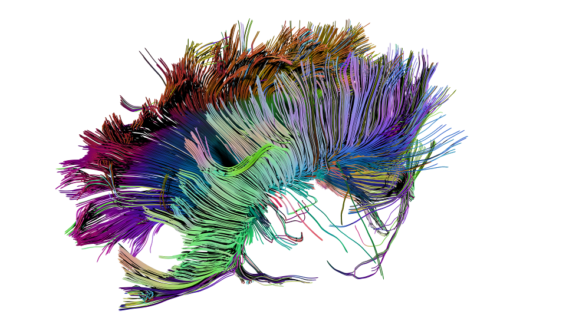

# DTI plugin for Brayns

## Description
This module implements the visualization of diffusion magnetic resonance imaging

## Usage
- Point LD_LIBRARY_PATH to the folder which contains
  'libdti.so'
- Run Brayns application either with command line '--plugin dti'

## Screenshots

