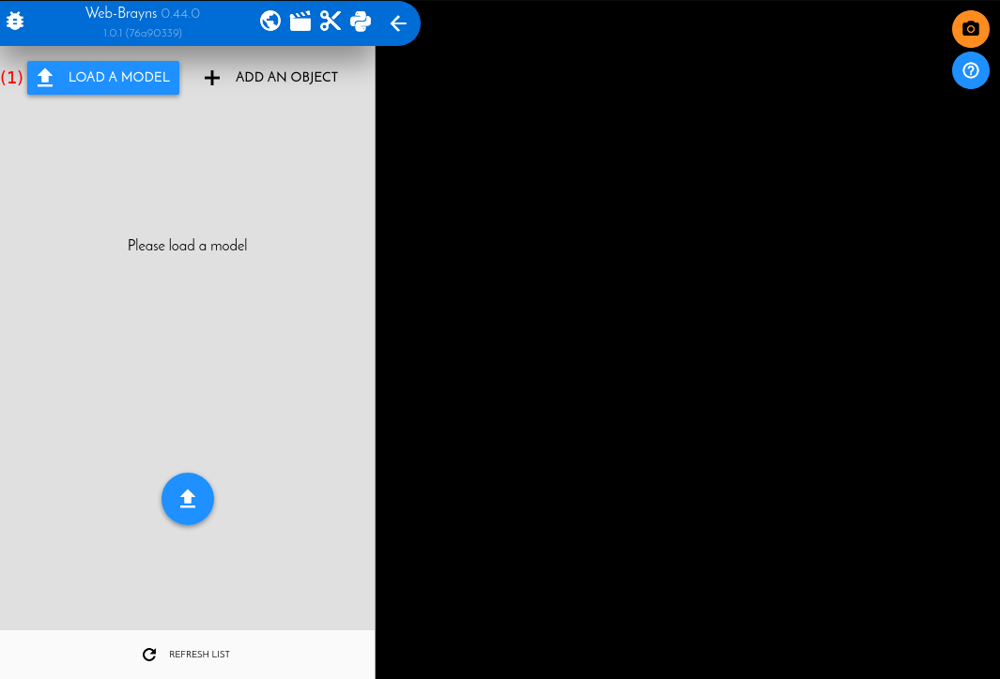
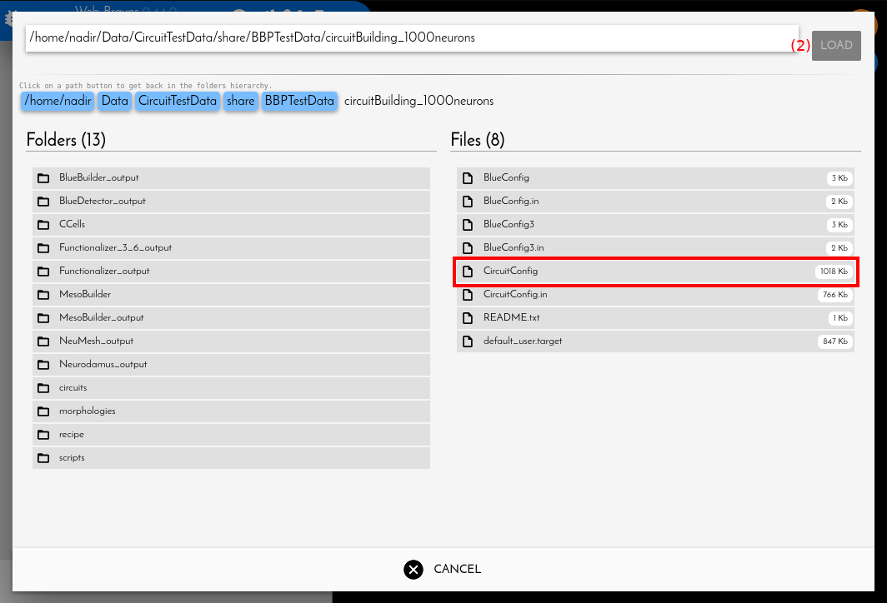
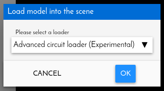
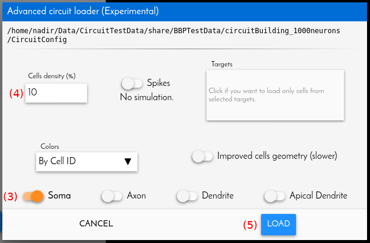
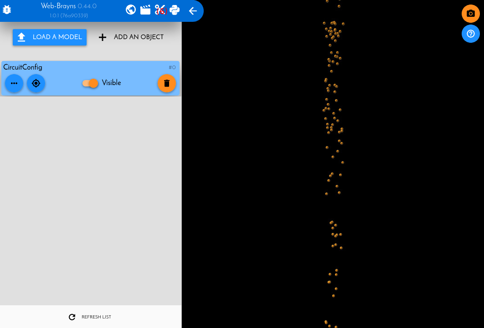
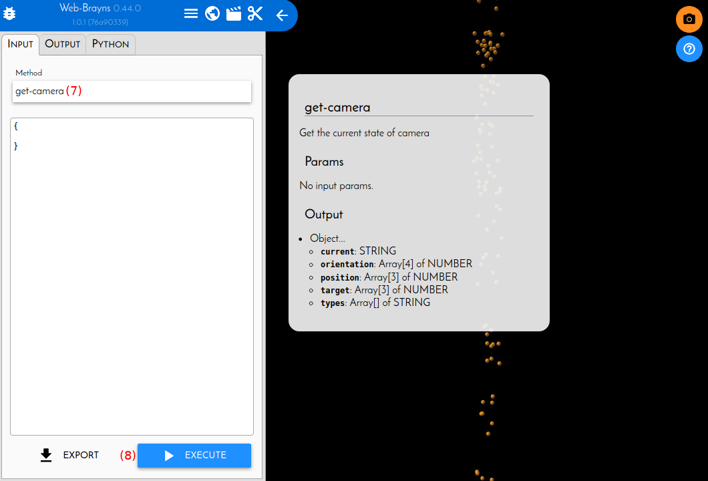
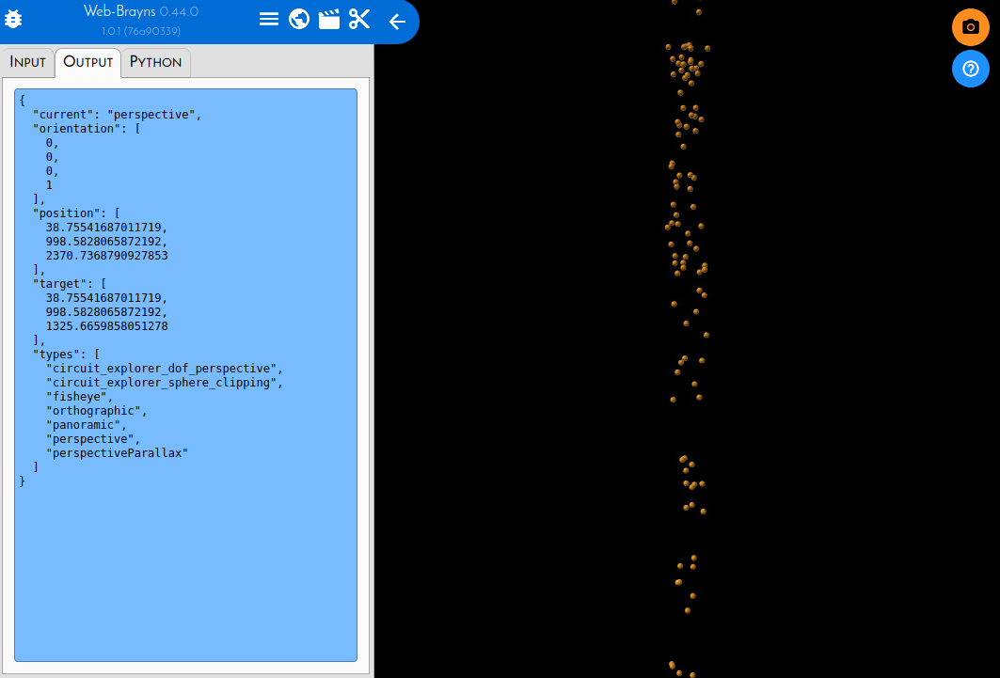
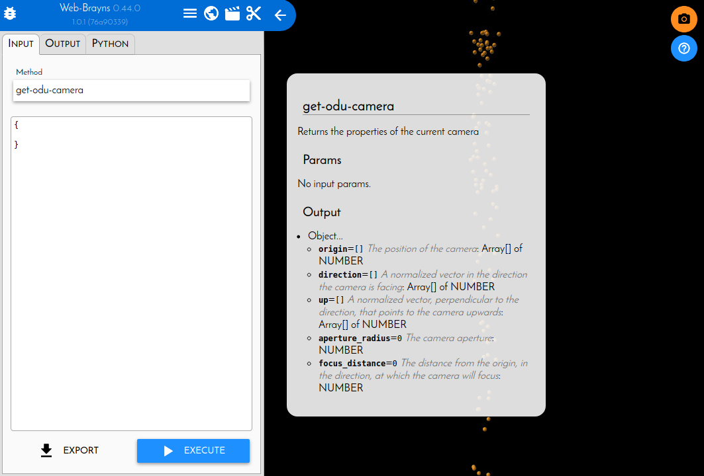
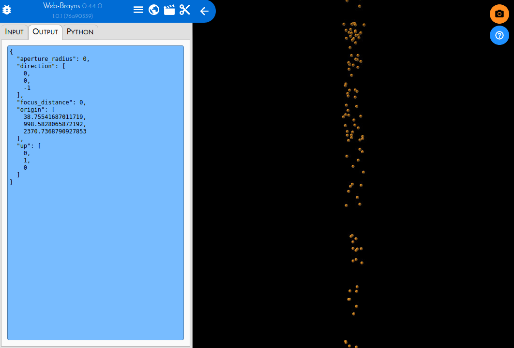

.. _examplegetcamera-label:

.. |location_link| raw:: html

   <a href="http://webbrayns.ocp.bbp.epfl.ch" target="_blank">WebBrayns</a>

Get desired camera view
=======================

When executing a batched process (such as rendering a high quality screenshot,
recording a simulation or rendering a morphology collage) we are not using Brayns
web interface, where we can navigate the scene using the mouse. Instead, we set up
the models within the scene and send them for rendering, waiting for the result.

For this purpose, is good to know how to find a camera angle that we desire, from
where we want to render our images or video, get the definition of the camera from
this point of view, and then use it in our scripts.

This task is easily accomplished using WebBrayns, following the next steps.

1 - Run a Brayns backend service and access WebBrayns
-----------------------------------------------------

If you do not have a running Brayns backend service, you can refer to :ref:`launchbraynsbackend-label`.

Once the backend is running, and you know the host (or BB5 node ID) and port
where is running, you can access |location_link| using this data.

2 - Load a fast version of your model/circuit
---------------------------------------------

Once we have access WebBrayns, we will see a screen like this:

By clicking on ``LOAD MODEL`` (1), we will access the loading system. We will be presented with
WebBrayns file browser. On it, we have to navigate to the directory containing the model/CircuitConfig/
BlueConfig:

There we will have to select it and click on ``LOAD`` (2). Then we will be presented
with the menu to choose a file loader.

WebBrayns will match the selected file with its corresponding loader, so all we have to do
is to click on ``OK``. Then we will be presented with the loader configuration window:

Here we can change the settings to load what we want. Because we only want to have an overview
of the circuit to know where to locate the camera, choosing to load only the somas (3), with a
reduced density percent (4), will allow us to load the model fast, and be able to have a more
interactive navigation. After we click on ``LOAD`` (5), the loading process will begin. When finish,
we will see something like this:

Now our circuit is loaded, and we can use the mouse to move the camera around:

*  Left button pressed & drag: Rotate de camera around the circuit.
*  Right button pressed & drag: View panning.

3 - Request the camera parameters
---------------------------------

When we have positioned the camera where we want, we can click on the Python Icon on the
top left menu bar (6), where we will request Brayns the camera parameters that we will use
in our python script.

Depending on the type of rendering we want to do with brayns, we will need to perform different requests.

3.1 - Request camera parameters for a snapshot rendering
~~~~~~~~~~~~~~~~~~~~~~~~~~~~~~~~~~~~~~~~~~~~~~~~~~~~~~~~

For a static image rendering, we will want to request the normal camera parameters:

On the command input (7), we will write ``get-camera``. The input is auto-complete, and documentation will
pop-up when we select a command, for further information. Then we press ``EXECUTE`` (8), and the result
request will appear:

Now that we have the camera parameters, we can use them to place the camera in the same position
when executing our script to take a snapshot:

.. code-block:: python

    # Needed import
    from brayns import Client
    import base64

    # Stablish the connection
    braynsClient = Client("r1i1n1.bbp.epfl.ch:5000")

    # Load model/circuit/morphology/... in full detail
    braynsClient.add_model(...)

    # Set up the camera where we wish
    braynsClient.set_camera(current="perspective",
                            orientation=[0,0,0,1],
                            position=[38.755, 998.582, 2370.736],
                            target=[38.755, 998.582, 1325.665],
                            types=[])

    # Now our camera is in the same position as we had it in the web interface
    # We can proceed to render the screenshot

    path = "/home/nroman/Desktop/my_first_brayns_snapshot.png"

    rend = braynsClient.get_renderer()

    imgData = braynsClient.snapshot(format="PNG",
                                    size=[3840,2160],
                                    quality=0,
                                    samples_per_pixel=64,
                                    renderer=rend)['data']

    binaryImgData = base64.b64decode(imgData)
    with open(path, "wb") as fh:
        fh.write(binaryImgData)

3.1 - Request camera parameters for a simulation video rendering
~~~~~~~~~~~~~~~~~~~~~~~~~~~~~~~~~~~~~~~~~~~~~~~~~~~~~~~~~~~~~~~~

The rendering of a simulation video requires to use a different camera definition, the ODU
(Origin, Direction, Up). We can calculate these 3 vectors from the normal ``get-camera`` parameters
orientation:

* ``origin`` is the same as ``position``.
* ``direction`` is the normalized vector ``target`` - ``position``
* ``up`` is computed by multiplying the vector `(0,1,0)` by ``orientation``

However, there is a simpler way, given that Brayns can already do the translation for us, and
we can request it the same way as we did for the ``get-camera`` parameters for the snapshot case.
Again on WebBrayns python console:

We type the command ``get-odu-camera`` and press ``EXECUTE``. We will be presented with the desired
parameters:

Now we have the camera in the position we wanted, and the parameters in the format that the
simulation movie command understands, so we can proceed to record the simulation.

.. important::

    To record a simulation, the ``export_frames_to_disk`` from the CircuitExplorer API is employed.
    This command requires to send a list of frames to render, and, for each frame, a odu camera definition.
    For further and more detailed information regarding simulation video rendering,
    refer to :ref:`recordsimulationexample-label`.

.. code-block:: python

    # Needed import
    from brayns import Client

    # Stablish the connection
    braynsClient = Client("r1i1n1.bbp.epfl.ch:5000")

    # Load simulation circuit in full detail
    braynsClient.add_model(...)

    # Store the camera definition for a single frame in a packed array
    # following the order:
    single_frame_odu_camera = [38.755, 998.582, 2370.736, # origin
                               0, 0, -1,                  # direction
                               0, 1, 0,                   # up
                               0,                         # apperture radius
                               0]                         # focus distance

    # Chose the frames to export (in this case, the first 100 frames)
    frames = list()
    full_odu_camera = list()
    for i in range(100):
        frames.append(i)
        # For each frame, copy the contents into the full array
        full_odu_camera.extend(single_frame_odu_camera)

    # Now we have prepared the frame and camera data, we can request the frames to be exported

    export_frames_to_disk(spp=64,                                   # 64 samples per pixel for good quality
                          camera_information=full_odu_camera,       # the odu camera information we created
                          quality=0,                                # Maximun image compression quality
                          animation_information=frames,             # The list of frames we want to export
                          format='PNG',                             # The format of the exported frames
                          path='/path/where/frames/will/be/stored', # Where they will be stored
                          start_frame=0)                            # At which index of the given animation_information to start.
