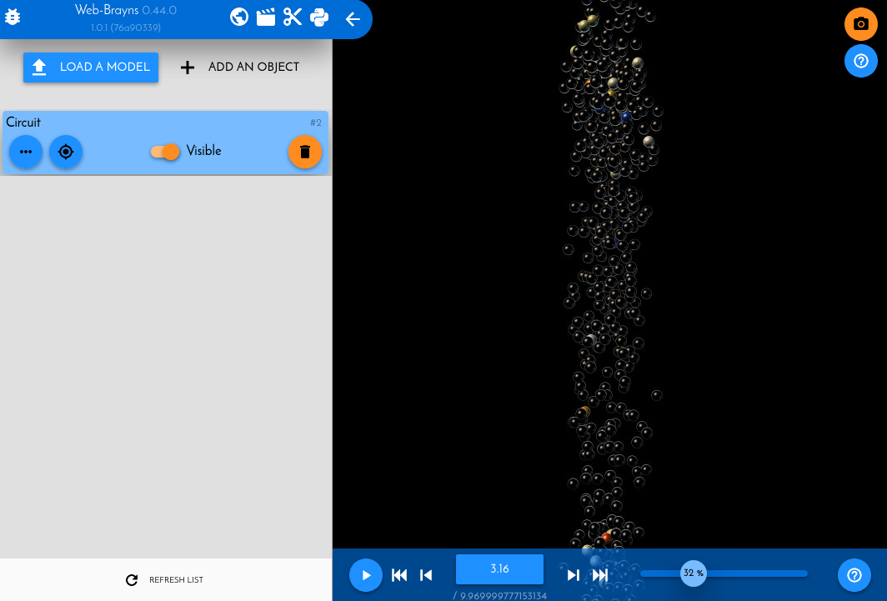

.. |location_link| raw:: html

   <a href="http://webbrayns.ocp.bbp.epfl.ch" target="_blank">WebBrayns</a>

Load a circuit with a spike report
==================================

In this example we will load a BlueConfig file from a circuit, specifying it
to load as well a Spike report. The functionality to load and parse circuits and
simulation reports is shipped in the CircuitExplorer plugin, so the backend should
have been launched with the arguments to load it.

We will make use of the :ref:`cemodule-label` API, as it make it much easier to load
circuits into Brayns.

For further information on how to get started coding in Brayns, refer to:

* :ref:`launchbraynsbackend-label` to get a running Brayns service.
* :ref:`usepythonclinet-label` to learn the first steps for any Brayns python client script.

Initialization
~~~~~~~~~~~~~~

For the initialization we add the needed imports, initialize both Brayns client and the
CircuitExplorer module, and define the path to our circuit.

.. code-block:: python

    from brayns import Client, CircuitExplorer

    PATH_TO_CIRCUIT = "/home/nadir/Data/CircuitTestData/share/BBPTestData/circuitBuilding_1000neurons/BlueConfig"

    braynsClient = Client("r1i1n1.bbp.epfl.ch:5000")
    circuitExplorer = CircuitExplorer(braynsClient)

Circuit loading
~~~~~~~~~~~~~~~

We have now all the needed objects to actually request the circuit to be loaded by brayns.
This is done with a single API call from the CircuitExplorer module API: ``load_circuit``.

.. code-block:: python

    res = circuitExplorer.load_circuit(
                path=PATH_TO_CIRCUIT,                           # The circuit itself
                density=100.0,                                  # We want the full density
                report_type=CircuitExplorer.REPORT_TYPE_SPIKES, # We want to load the spike report
                load_soma=True,                                 # We want to load the somas
                load_axon=False,                                # We do NOT want to load the axons
                load_dendrite=False,                            # We do NOT want to load the dendrites
                load_apical_dendrite=False,                     # We do NOT want to load the apical dendrites
                radius_multiplier=8.0                           # We want the soma to be "inflated" 8 times its normal size.
                )

After the function returns (which might take time if the circuit is large), on the
variable ``res`` we will have information about the model and the circuit. Now we can go to
|location_link| and navitage the circuit/play the simualtion, take a snapshot, etc.

