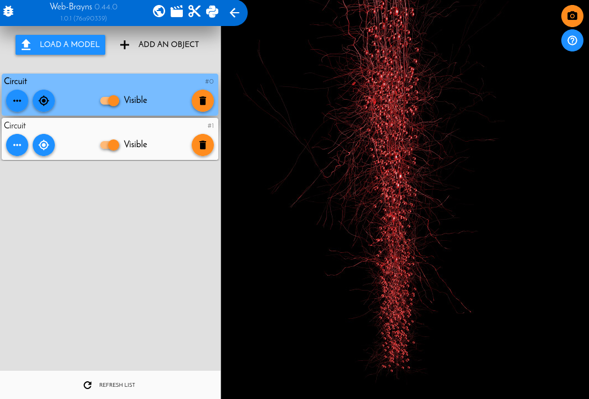

.. |location_link| raw:: html

   <a href="http://webbrayns.ocp.bbp.epfl.ch" target="_blank">WebBrayns</a>

Load a circuit with full morphologies and somas only
====================================================

In this example we will load a CircuitConfig file from a circuit. From all of its
cells, we will load some of them in full (soma + dendrites + apical dendrites), and
the rest just as somas only. This is useful when we want to visualize, for example,
the morphologies of a specific target within the whole circuit.

We will make use of the :ref:`cemodule-label` API, as it make it much easier to load
circuits into Brayns, as well as the :ref:`circuitinfoapi-label` to get information
about the cell GIDs. Both plugins must be specified when launching the Brayns backend.

For further information on how to get started coding in Brayns, refer to:

* :ref:`launchbraynsbackend-label` to get a running Brayns service.
* :ref:`usepythonclinet-label` to learn the first steps for any Brayns python client script.

Initialization
~~~~~~~~~~~~~~

For the initialization we add the needed imports, initialize both Brayns client and the
CircuitExplorer module, and define the path to our circuit and the targets we want to
load in full.

.. code-block:: python

    from brayns import Client, CircuitExplorer

    PATH_TO_CIRCUIT = "/home/nadir/Data/CircuitTestData/share/BBPTestData/circuitBuilding_1000neurons/CircuitConfig"

    LOAD_FULL_TARGETS = ["mini50"]

    braynsClient = Client("r1i1n1.bbp.epfl.ch:5000")
    circuitExplorer = CircuitExplorer(braynsClient)

Gather GIDs information
~~~~~~~~~~~~~~~~~~~~~~~

Brayns cannot load a circuit with different morphology configuration. This means that
we will actually load the circuit twize: One for the targets with full morpholgies, and
another for the rest of the targets with somas only.

To achieve this, we will use the Circuit Info API to:

*  Get the GIDs of all the cells in the circuit.
*  Get the GIDs of the cells specified in the ``LOAD_FULL_TARGETS`` variable.
*  Substract the full morphologies GIDs from all the rest, so we do not load them twice.

.. code-block:: python

    # Request all the circuit GIDs
    all_gids = set(
        braynsClient.ci_get_cell_ids(path=PATH_TO_CIRCUIT, targets=[])['ids']
    )

    # Request all the full targets GIDs
    target_gids = set(
        braynsClient.ci_get_cell_ids(path=PATH_TO_CIRCUIT, targets=LOAD_FULL_TARGETS)['ids']
        )

    # Substract the target gids from all gids
    somas_only_gids = list(all_gids - target_gids)
    full_morphology_gids = list(target_gids)

Load circuit
~~~~~~~~~~~~

Now we have two GID list: one for the somas only cells, and one for the full morphology cells.
Now we will perform the 2 circuit loads, using these lists, to get the desired result.

.. code-block:: python

    # Load full morpholgoies
    circuitExplorer.load_circuit(
            path=PATH_TO_CIRCUIT,                           # The circuit itself
            density=100.0,                                  # We want the full density
            gids=full_morphology_gids,                      # Specify which GIDs from the circuit to load
            load_soma=True,                                 # We want to load the somas
            load_axon=False,                                # We do NOT want to load the axons
            load_dendrite=True,                             # We want to load the dendrites
            load_apical_dendrite=True ,                     # We want to load the apical dendrites
            radius_multiplier=2.0                           # We want the morphology to be "inflated" 2 times its normal size.
            )

    # Load somas only
    circuitExplorer.load_circuit(
            path=PATH_TO_CIRCUIT,
            density=100.0,
            gids=somas_only_gids,                           # Specify which GIDs from the circuit to load
            load_soma=True,                                 # We want to load the somas
            load_axon=False,                                # We do NOT want to load the axons
            load_dendrite=False,                            # We do NOT want to load the dendrites
            load_apical_dendrite=False,                     # We do NOT want to load the apical dendrites
            radius_multiplier=5.0                           # We want the soma to be "inflated" 5 times its normal size.
            )

After the functions returns (which might take time if the circuit is large),  we can go to
|location_link| and navitage the circuit, take a snapshot, etc.

