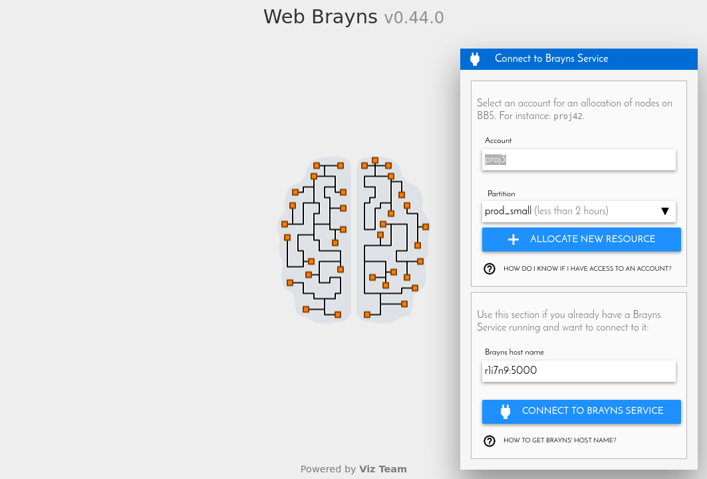

.. _launchbraynsbackend-label:

.. |location_link| raw:: html

   <a href="http://webbrayns.ocp.bbp.epfl.ch" target="_blank">WebBrayns</a>

Running a Brayns backend service
================================

As a Brayns client, to run any script that uses the Brayns python client API you must have access to a
running Brayns server backend. You have two ways to start a Brayns backend: Thought
WebBrayns web interface or manually on BB5

Automatic allocation through WebBrayns
--------------------------------------

The easiest way to launch a Brayns backend service is throught WebBrayns. It offers an easy to follow interface
which will allocate a node on BB5 and launch a Brayns backend instance for you.

From the URL you will be able to extract the node ID and the port on which Brayns is running.

To do so, go to |location_link|. You will see something like this:

Enter your project account and type of partition to use and then click on
``+ ALLOCATE NEW RESOURCE``.
There is a contextual help to guide you throught out the process if you need it.

.. warning::

   At the momment, is not possible to choose which plugins will be loaded when launching
   the Brayns backend service from WebBrayns. Currently, only the ``CircuitExplorer``
   and ``CircuitInfo`` plugins are loaded.

Manual launch on BB5
--------------------

To launch a Brayns backend manually, the first step is to know the path to a ``braynsService`` executable

For instance, the master branch of the respository is downloaded and compiled in BB5, and can be found in:

``/gpfs/bbp.cscs.ch/home/nroman/software/install/linux-rhel7-x86_64/gcc-8.3.0/brayns-latest-s44b7v/bin``

Once we know the location of the ``braynsService`` binary, we proceed:

* 1 - Get an allocation on BB5:

.. code-block:: console

    $ salloc --account=<your project account> --partition=prod --exclusive --constraint=cpu -c 72 --mem 0

Where ``your_project_account`` should be the project account you have access to on BB5.
After a successful allocation, you will be shown with the node ID or host of your allocation. It is composed of alpha-numeric
characters, for example: ``r2i2n11``. You will need it to connect to the ``braynsService`` from your python client.

* 2 - Launch the ``braynsService`` server:

.. code-block:: console

    $ cd /gpfs/bbp.cscs.ch/home/nroman/software/install/linux-rhel7-x86_64/gcc-8.3.0/brayns-latest-s44b7v/bin
    $ ./braynsService --http-server :5000 --plugin braynsCircuitExplorer --plugin braynsCircuitInfo --plugin braynsDTI

The last command will launch a Brayns backend service with remote access needed for the python client (``--http-server``)
on port 5000, and enabling the Circuit Explorer, Circuit Info and DTI plugins

.. hint::

   Brayns, by default, does not understand about science-specific models. The specific functionality is loaded using
   plugins. ``CircuitExplorer`` plugin is the main plugin for neuroscientific visualization that you will want to load.
   For further information on plugins, check :ref:`plugins-label`.

Now we know the host (node ID) and port (5000 in this case) where our Brayns backend is running. We will need both to
connect throught the python client.
